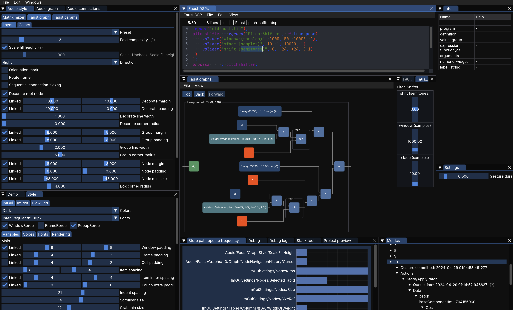

# FlowGrid

FlowGrid is an immediate-mode interface for [Faust](https://github.com/grame-cncm/faust) (functional audio language) programs.
The full project state is backed by a persistent (as in persistent data structures) store supporting constant-time navigation to any point in project history.

Includes:
* A from-scratch syntax aware embedded text editor with a language-complete [Faust tree-sitter grammar](https://github.com/khiner/tree-sitter-faust) for editing LLVM JIT-compiled Faust
* A complete implementation of the Faust DSP UI spec, including layout and metadata
* A highly configurable/monitorable audio graph editor and matrix mixer
* Automatic, configurable resampling at any audio node
* Any number of Faust nodes, each running separately running/controllable DSP
* Any number of audio I/O nodes wrapping any native audio I/O format
* [Much more!](#features)



Still in its early stages, with no supported release yet - expect things to be broken!

_Note: I'm still interested and committed to the project, but work is temporarily paused to focus on a [Vulkan-based 3D mesh/rigid-body-audio-model editor](https://github.com/khiner/MeshEditor)._

## Project goals

FlowGrid aims to be a fast, effective, and fun tool for creative real-time audiovisual generation and manipulation.
My goal with FlowGrid is to create a framework for patching together artful interactive audiovisual programs (modular, programmable, multimodal jam boxes) by freely connecting media/data streams together.
Long-term, I aim for FlowGrid to be expressive and general enough to be considered a full-fledged audiovisual programming language for creatively generating, manipulating, and combining streams across many domains (media/data/network/...).
This is a long-term passion project that started in 2022 (with a [previous approach](https://github.com/khiner/flowgrid_old) starting in 2019) that I hope to poke at for many years :) [Tim Exile's Flow Machine](https://youtu.be/hQbg-uHwcig) is the project's spiritual North Star 🌟

The "Flow" half of FlowGrid reflects the user experience goal to fascilitate a state of joyful and explorative flow.
The "Grid" half refers to an ambition to use, as the primary UX paradigm, an "infinitely" nested grid of subgrids, with each cell being a module accepting connections on all sides.
This idea stemmed from considering how to maximize the expressive power of a single Push 2 controller (or any grid-like controller, such as many from Akai, equipped with an LED and/or paired with a screen).
I haven't gotten to this aspect yet here, but I explored it in [a previous approach using JUCE](https://github.com/khiner/flowgrid_old) before starting fresh with this project with a new stack and development goals.

## Architecture goals

Early on in the development process, I am focusing on building a solid application architecutre to make feature development fast and fun.

Any robust application needs to get a lot right apart from just its features - project state data structure, low-latency state updates from actions & view updates from state, sane event system, serialization, undo/redo history, load/save, backup, debuggability, error management.
More than anything, it's important to find ways to make it as easy as possible to add new feasures, ideally without needing to think about any of the above _at all_.

Doing it the other way around - starting with features and _then_ eating the broccolli and trying to tie together all existing features into a legit application with the above meta-features - is very difficult and slow in my experience.
A big part of this project is about exploring patterns for getting this right.
I'd say overall, I've happy-ish with the direction here so far, but there is a lot I'd like to improve and explore.

Towards this end, here are some (in-progress) development goals/thoughts:
- **Determinism:** The state should, as much as possible, _fully specify_ the current application instance at any point in time. Closing and opening a project should continue all streams where they left off, including the `DrawData` stream ImGui uses to render its viewport(s).
- **Low latency:** Minimize the duration between the time the application receives an input signal, and the corresponding output device respond time (e.g., pixels on screen, audio output, file I/O).
  Note that low latency applies to _all_ types of input, which currently include:
    - Audio signals from any audio input device on your machine, at any natively-supported sample rate.
    - Mouse/keyboard input.
    - _TODOs:_ MIDI, most likely using [libremidi](https://github.com/celtera/libremidi) as the backend, targeting Push 2 first (see [Old-FlowGrid implementation](https://github.com/khiner/flowgrid_old/tree/main/src/push2)). USB (including writing to LED displays - see [Old-FlowGrid implementation](https://github.com/khiner/flowgrid_old/blob/main/src/usb/UsbCommunicator.h) but will rewrite from scratch since the API has likely changed and it wasn't rock-solid anyway). OSC (Open Sound Control). WebSockets.
- **Fast random access to application state history:**
  FlowGrid uses [persistent data structures](https://github.com/arximboldi/lager) to store its state.
  After each [action](#Application-state-architecture), FlowGrid creates a snapshot of the application store and adds it to the history (which will eventually be a full navigation tree), allowing for _constant-time_ navigation to _any point_ in the history.
  In most applications, if a user e.g. just performed their 10th action and wants to go back to where they were after their first action, they would either manually undo 9 times, or if a random access interface is provided, the application would do this under the hood (in linear time, like rewinding a tape).
  FlowGrid, on the other hand, provides navigating to _any point in the application history_ (almost always*) at _frame rate or faster_.
    This opens up many potential creative applications that are not possible with other applications, like, say, muting the audio output device, and then issuing `[undo, redo]` actions at audio rate, for a makeshift square wave generator!

  _\* Some kinds of state changes have higher effect latency, like changing an audio IO device._
- **Fast rebuild:** Keeping build times low is crucial, as full rebuilds are frequent.
  Minimizing the duration between the edit time of a valid FlowGrid source-code file and the application start time after recompilation is crucial.
  Making compilation snappy isn't just about saving the extra seconds waiting. It's about minimizing the feedback loop between ideation and execution, and making the _process_ of building more engaging.
  _FlowGrid is currently not great in this department and I want to make recompile times faster._

## Application State Architecture

FlowGrid uses a unidirectional data-flow architecture, similar to Redux.
The architecture draws heavy inspiration from [Lager](https://github.com/arximboldi/lager), albeit with fewer features and dependencies, with [immer](https://github.com/arximboldi/immer/) being the sole exception.

User actions are encapsulated in plain structs, containing all necessary information to update the project state.
Actions are organized into `std::variant` types, arranged in a nested domain hierarchy.
At the root of this structure is a variant type named `Action::Any`.
All actions are enqueued into a single concurrent queue, with each action applied subsequently overwriting the project store.
Actions are grouped by their relative queue time and type, merging into "gestures" at the time of commitment.
Each gesture represents a coherent, undoable group of actions.
Every committed gesture is recorded in a "history record," which includes the gesture itself and a _logical snapshot_ of the entire project state resulting from its application.
If you're unfamiliar with persistent data structures, this is much less memory intensive than it sounds!
Each snapshot only needs to track a relatively small amount of data representing its changes to the underlying store, a concept referred to as "structural sharing".

## Application docs

### Project files

FlowGrid supports two project formats.
When saving a project, you can select any of these formats using the filter dropdown in the lower-right of the file dialog.
Each type of FlowGrid project file is saved as plain JSON.

- `.fgs`: _FlowGrid**State**_
  - The full project state.
    An `.fgs` file contains a JSON blob with all the information needed to get back to the saved project state.
    Loading a `.fgs` project file will completely replace the project state with its own.
  - As a special case, the project file `./flowgrid/empty.fgs` (relative to the project build folder) is used internally to load projects.
    This `empty.fgs` file is used internally to implement the `open_empty_project` action, which can be triggered via the `File->New project` menu item, or with `Cmd+n`.
    FlowGrid (over-)writes this file every launch, after initializing to empty-project values (and, currently, rendering two frames to let ImGui fully establish its context).
    This approach provides a pretty strong guarantee that loading a new project will always produce the same, valid empty-project state.
- `.fga`: _FlowGrid**Actions**_
  - FlowGrid can also save and load projects as a list of _action gestures_.
    This format stores an ordered record of _every action_ that affected the project state up to the time it was saved.
    More accurately, an `.fga` file is a list _of lists_ of (action, timestamp) pairs.
    Each top-level list represents a logical _gesture_, composed of a list of actions, along with the absolute time they occurred.
    Each action item contains all the information needed to carry out its effect on the project state.
    In other words, each list of actions in an `.fga` file tells you, in application-domain semantics, what _happened_.
  - **Gesture compression:** Actions within each gesture are compressed down to a potentially smaller set of actions.
    This compression is done in a way that retains the same project state effects, while also keeping the same application-domain semantics.

### Features

* A fast from-scratch embedded text editor with the following features:
  - tree-sitter syntax parsing and highlighting, with a full [Faust tree-sitter grammar](https://github.com/khiner/tree-sitter-faust) built by me with complete language support
  - Hover to show tree-sitter syntax node and ancestors, integrated into application info pane
  - Persistent buffer data structure, based on [ewig](https://github.com/arximboldi/ewig/blob/master/src/ewig/buffer.hpp), with variant-based actions fully integrated into application state & history
  - Multiple cursors with character/word/line/page-based movement, selection, and deletion
  - Indentation and commenting shortcuts
  - Debug view showing editor state
  - Find/select next occurrence
  - Usual insert/delete/copy/paste/load/save capabilities
  - Edit-recompile integration with Faust features (graph, audio, DSP parameter UI)
* Extensive audio device configuration, supporting selection of any input device and output device, with _separate control over input/output device native configuration_, with automatic format/sample-rate conversion when necessary.
  - This is a rare feature in DAWs, which usually provide a single application-level sample-rate conversion, and then automatically select native sample rates that match. This exemplifies the design philosophy of FlowGrid, to enable full control when possible, with solid defaults.
  - In fact, each node in the audio graph (see below) can have its own sample rate, with automatic conversion into and out of the node!
  - Also, you can add and connect multiple audio input/output devices, including duplicates with different configurations!
* Comprehensive, fully-undoable style editing of layout and style
  - ImGui state management is [fully](https://github.com/khiner/imgui/tree/docking) [reimplemented](https://github.com/khiner/flowgrid/blob/main/src/FlowGrid/Core/ImGuiSettings.h) to integrate with FlowGrid's persistent data store, so that e.g. undocking a window, changing the docking layout, changing style configuration, or anything affecting what you see in the UI is fully undoable!
* Complete Faust graph visualization, navigation, and SVG export with comprehensive style editing
  - FlowGrid includes a [complete reimplementation](https://github.com/khiner/flowgrid/blob/main/src/FlowGrid/Project/Audio/Faust/FaustGraph.cpp) of [Faust's SVG graph visualization](https://github.com/grame-cncm/faust/tree/master-dev/compiler/draw) to render in both SVG and ImGui.
  It is deeply configurable, including adjustable fold complexity to control the number of boxes within a graph before folding into a sub-graph. It has a persistent/undoable navigation history and style editor, with a style preset designed to mimic the original Faust style exactly, with navigable SVG export.
* Faust DSP ImGui parameter UI implementation
  - Using ImGui's table layout, supports all Faust param UI [groupings](https://github.com/khiner/flowgrid/blob/1ef82897f819ad267537ad9221aedac4507dad4b/src/FlowGrid/Project/Audio/Faust/FaustParamGroup.cpp) and [widgets](https://github.com/khiner/flowgrid/blob/1ef82897f819ad267537ad9221aedac4507dad4b/src/FlowGrid/Project/Audio/Faust/FaustParam.cpp), including hover tooltip metadata and display style metadata (e.g. knob vs. slider or horizontal vs. vertical), with arbitrary group nesting.
* Audio graph
  - Matrix mixer for arbitrary audio graph node connections
  - Optional level/pan and waveform/spectrum monitoring for each node.
  - Add multiple device input/output nodes, multiple Faust nodes (each running in a separate Faust process and managed by its own set of DSP text editor/graph/params UI components)
  - Waveform node with configurable waveform type, frequency and amplitude
    - This is a custom DSP nodes separate from Faust, and is a proof-of-concept for integrating Faust with other custom C++ DSP, in addition to audio I/O.
* Integrated hierarchical hover info panel
* Extensive debugging capabilities and insight into application state
  - Live histogram showing the update frequency of each state path, with gesture grouping.
  - Detailed tree view of:
    * All project gestures/actions
    * Full project state (both the complete hierarchical state representation and action state)
    * Live auto-expand/navigate/flash-highlight to changed state tree node
* Much more!

## Clean/Build/Run

This project uses LLVM IR to JIT-compile Faust code.
To simplify, make things more predictable, and reduce bloat, we use the LLVM ecosystem as much as possible - `clang++/clang` to compile, and LLVM's `lld` for linking.
Even if it's not strictly required, I generally aim to use the latest LLVM release available on HomeBrew.
If the project does not build correctly for you, please make sure your `clang`, `lld`, and `clang-config` point to the newest available point-release of LLVM.
If that doesn't work, try the latest release in the previous LLVM major version.

### Mac

- **Install system requirements:**

  ```shell
  $ git clone --recursive git@github.com:khiner/flowgrid.git
  $ brew install cmake pkgconfig llvm freetype fftw
  $ brew link llvm --force
  ```

- Download and install the latest SDK from https://vulkan.lunarg.com/sdk/home
- Set the `VULKAN_SDK` environment variable.
  For example, add the following to your `.zshrc` file:
  ```shell
  export VULKAN_SDK="$HOME/VulkanSDK/{version}/macOS"
  ```

All scripts can be run from anywhere, but to the root repo directory (clean/build).

- **Clean:**
  - Clean up everything: `./script/Clean`
  - Clean debug build only: `./script/Clean -d [--debug]`
  - Clean release build only: `./script/Clean -r [--release]`
- **Build:**
  - Debug build (default): `./script/Build`
  - Release build: `./script/Build -r [--release]`
  - Tracy build: `./script/Build -t [--trace]`

Debug build is generated in the `./build` directory relative to project (repo) root.
Release build is generated in `./build-release`.
Tracy build generated in `./build-tracing`

To run the freshly built application:

```sh
# The application assumes it's being run from the build directory when locating its resource files (e.g. font files).
$ cd build # or build-release
$ ./FlowGrid # Must be run from a directory above root. todo run from anywhere
```

If the build/run doesn't work for you, please [file an issue](https://github.com/khiner/flowgrid/issues/new), providing your environment and any other relevant details, and I will try and repro/fix!

## Stack

### Audio

- [Faust](https://github.com/grame-cncm/faust) for DSP
- [miniaudio](https://github.com/mackron/miniaudio) for the audio backend
- [fftw](https://www.fftw.org/) for computing spectrograms (visualized with ImPlot)

### UI

- [ImGui](https://github.com/ocornut/imgui) + [SDL3](https://github.com/libsdl-org/SDL) + [Vulkan](https://www.vulkan.org/) + [FreeType](https://freetype.org): UI
  - Using fonts: [Inter 4.0](https://github.com/rsms/inter/releases/tag/v4.0) for regular text and [JetBrains Mono 2.304](https://www.jetbrains.com/lp/mono/) for monospace
- [ImPlot](https://github.com/epezent/implot): plotting
- [ImGuiFileDialog](https://github.com/aiekick/ImGuiFileDialog): file selection

### Backend

- [immer](https://github.com/arximboldi/immer): persistent data structures for the main project state store
  - Used to quickly create, store, and restore persistent state snapshot
    (used for undo/redo, and for debugging/inspection/monitoring)
- [json](https://github.com/nlohmann/json): state serialization
- [tree-sitter](https://github.com/tree-sitter/tree-sitter): Language parsing for syntax highlighting in text buffers
- [ConcurrentQueue](https://github.com/cameron314/concurrentqueue): the main action queue
  - Actions are _processed_ synchronously on the UI thread, but any thread can submit actions to the queue.

### C++ extensions

- [range-v3](https://github.com/ericniebler/range-v3)
  - Only still needed since `std::ranges::concat` was pushed to C++26 and isn't supported by clang yet, (also `std::views::join_with`)

### Debugging

- [Tracy](https://github.com/wolfpld/tracy) for real-time profiling

## Development

I try and keep all dependencies up to date.
LLVM 18 is required to build.

### Formatting

FlowGrid uses `clang-format` for code formatting.
`./script/Format` formats every cxx file in `src`.

### Tracing

Use `./script/Build -t [--trace]` to create a traced build.

To build and run the [Tracy](https://github.com/wolfpld/tracy) profiler, run:

```sh
$ brew install gtk+3 glfw capstone freetype
$ cd lib/tracy/profiler/build/unix
$ make release
$ ./Tracy-release
```

### Updating submodules

All submodules are in the `lib` directory.

#### Non-forked submodules

Most submodules are not forked.
Here is my process for updating to the tip of all the submodule branches:

```sh
$ git submodule update --remote
$ git add .
$ git cm -m "Update libs"
```

#### Forked submodules

The following modules are forked by me, along with the upstream branch the fork is based on:

- [`imgui:docking`](https://github.com/khiner/imgui/tree/docking)
- [`implot:master`](https://github.com/khiner/implot)
- [`miniaudio:dev`](https://github.com/khiner/miniaudio)

I keep my changes rebased on top of the original repo branches.
Here's my process:

```sh
$ cd lib/{library}
$ git pull --rebase upstream {branch} # `upstream` points to the original repo. See list above for the tracked branch
$ ... # Resolve any conflicts & test
$ git push --force
```

## License

This software is distributed under the [GPL v3 License](./LICENSE).

GPL v3 is a strong copyleft license, which basically means any copy or modification of the code in this repo (excluding any libraries in the `lib` directory with different licenses) must also be released under the GPL v3 license.

### Why copyleft?

The audio world has plenty of open-source resources, but proprietary intellectual property dominates the commercial audio software industry.

A permissive license allowing closed-source commercial usage may help more end users (musicians, artists, creators) in the short term, but it doesn't help developers.
As a music producer, finding excellent software or hardware is relatively easy.
As a developer, however, I've had a much harder time finding resources, tools, and strategies for effective audio software development.

Although this project is first and foremost a creative tool, the intention and spirit is much more about hacking, learning, educating and researching than it is about producing end media products.
For these purposes, keeping the information open is more important than making the functionality freely and widely available.
